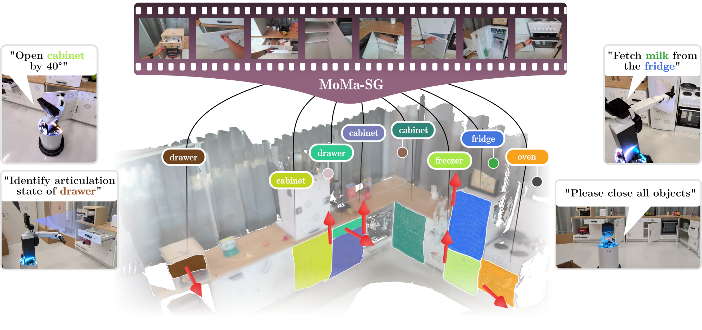

## MoMa-SG - Articulated 3D Scene Graphs

[](https://arxiv.org/abs/2602.16356)
[](https://momasg.cs.uni-freiburg.de/)
[](https://opensource.org/licenses/MIT)
[](https://momasg.cs.uni-freiburg.de/)

This repository is the official implementation of the paper:
> **Articulated 3D Scene Graphs for Open-World Mobile Manipulation** <br>
>
> 10th Annual Conference on Robot Learning 2026 (CoRL) <br>
> [Martin Büchner](https://rl.uni-freiburg.de/people/buechner)<sup>1</sup>,
[Adrian Röfer](https://rl.uni-freiburg.de/people/roefer)<sup>1</sup>,
[Tim Engelbracht](https://github.com/timengelbracht)<sup>2</sup>,
[Tim Welschehold](https://rl.uni-freiburg.de/people/welschehold)<sup>1</sup>,
[Zuria Bauer](https://cvg.ethz.ch/team/Dr-Zuria-Bauer)<sup>2</sup>,
[Hermann Blum](https://hermannblum.net/)<sup>2,3</sup>,
[Marc Pollefeys](https://people.inf.ethz.ch/marc.pollefeys/)<sup>2</sup>
[Abhinav Valada](https://rl.uni-freiburg.de/people/valada)<sup>1</sup>
>
><sup>1</sup>University of Freiburg,
><sup>2</sup>ETH Zürich,
><sup>3</sup>University of Bonn



## 🛠️ Installation

### 1. Create environment and install main dependencies 
The default configuration uses Python 3.11 and CUDA 12.1:
```bash
conda create -n momasg python=3.11
conda activate momasg

pip install torch==2.5.1 torchvision==0.20.1 torchaudio==2.5.1 --index-url https://download.pytorch.org/whl/cu121
pip install --no-deps -r requirements.txt 
pip install -e .
```

<details>
<summary><strong><em>Optional: Set CUDA paths on environment activation</em></strong></summary>

```bash
mkdir -p ~/miniconda3/envs/momasg/etc/conda/activate.d/
mkdir -p ~/miniconda3/envs/momasg/etc/conda/deactivate.d/
```

Run `nano ~/miniconda3/envs/momasg/etc/conda/activate.d/cuda.sh` and enter:
```bash
export CUDA_HOME=/usr/local/cuda-12.1
export PATH=$CUDA_HOME/bin:$PATH
export LD_LIBRARY_PATH=$CUDA_HOME/lib64:$LD_LIBRARY_PATH
```

Run `nano ~/miniconda3/envs/momasg/etc/conda/deactivate.d/cuda.sh` and enter:
```bash
unset CUDA_HOME
export PATH=$(echo $PATH | sed 's|/usr/local/cuda-12.1/bin:||')
export LD_LIBRARY_PATH=$(echo $LD_LIBRARY_PATH | sed 's|/usr/local/cuda-12.1/lib64:||')
```
</details>


### 2. Install Semantic-SAM: 
A. Clone Semantic-SAM fork that includes necessary adaptations to call it as a module within MoMa-SG:
```bash
cd ~/MoMa-SG/ && git clone git@github.com:martinbchnr/Semantic-SAM.git
cd Semantic-SAM/
mkdir ckpt && cd ckpt
wget https://github.com/UX-Decoder/Semantic-SAM/releases/download/checkpoint/swint_only_sam_many2many.pth
```

B. Install rust if necessary:
```bash
curl --proto '=https' --tlsv1.2 -sSf https://sh.rustup.rs | sh
source $HOME/.cargo/env
```

C. Install additional dependencies of Semantic-SAM:
```bash
pip install --no-build-isolation git+https://github.com/MaureenZOU/detectron2-xyz.git
pip install git+https://github.com/cocodataset/panopticapi.git

git clone https://github.com/facebookresearch/Mask2Former.git
cd Mask2Former/mask2former/modeling/pixel_decoder/ops
sh make.sh
```

### 3. Set up additional models
Go to base MoMa-SG repo directory and run the following to download checkpoints for TapNext++, YOLO11, MobileSAM

#### TapNext++ & YOLO11
```bash
mkdir checkpoints && cd checkpoints
wget --no-check-certificate https://storage.googleapis.com/dm-tapnet/tapnextpp/tapnextpp_ckpt.pt
wget https://huggingface.co/Ultralytics/YOLO11/resolve/a01aaa06caeff788b052e193acb76b3f21571b3a/yolo11x-seg.pt
```

#### MobileSAM
```bash
gdown --fuzzy https://drive.google.com/file/d/1dE-YAG-1mFCBmao2rHDp0n-PP4eH7SjE/view?usp=sharing
unzip weight.zip
mv weight/mobile_sam.pt .
```
In case the file is unavailable, download the checkpoint [here](https://github.com/ChaoningZhang/MobileSAM/tree/master/weights), unzip it and move it to the same location as mentioned above.

#### GPT-5-mini
Run `nano configs/keys.yaml` and enter `openai_key: INSERT-YOUR-KEY-HERE`


### 4. Optional: Install SAM2 for fine articulated object reconstruction
```bash
git clone https://github.com/facebookresearch/sam2.git && cd sam2
pip install -e .
```

### 5. Double-check custom paths
Under configs/momasg.yaml adapt:
- Modify `package_path` to be the main repo folder
- Change `dataset.root_path` to the stored location of Arti4D-Semantic
- Check additional model/checkpoint paths:
    - Semantic-SAM: path `mapping.semsam_path`
    - YOLOv11: `interaction.yolo_path`
    - Mobile-SAM: `interaction.msam_checkpoint`
    - TapNext++: `tracking.tap_path`
    - SAM2: `articulation.sam2_path` (optional)

## 🚀 Run
1. Define necessary paths in configs/momasg.yaml:
    - `dataset.root_path` needs to point to a sequence folder
    - 
3. Source the environment and run engine.py, provide scene path `dataset.root_path` in `configs/momasg.yaml` :
```bash
source ~/.bashrc
conda activate momasg

cd /path/to/MoMa-SG
python moma_sg/graph/engine.py 
```


## 🗄️ Arti4D-Semantic Benchmark
- Please download the following splits of the dataset including the metadata using `wget` or follow the download buttons on our [project site](https://momasg.cs.uni-freiburg.de)
- Create a dataset dir such as `path/to/artti4d-sem/`
- Unzip each file at this location to maintain the correct folder structure.

```bash
wget https://momasg.cs.uni-freiburg.de/download/arti4d/raw/metadata.zip
wget https://momasg.cs.uni-freiburg.de/download/arti4d/raw/rh201.zip
wget https://momasg.cs.uni-freiburg.de/download/arti4d/raw/rh078.zip
wget https://momasg.cs.uni-freiburg.de/download/arti4d/raw/rr080.zip
wget https://momasg.cs.uni-freiburg.de/download/arti4d/raw/din080.zip
wget https://momasg.cs.uni-freiburg.de/download/arti4d/raw/mhzh.zip
wget https://momasg.cs.uni-freiburg.de/download/arti4d/raw/mhzh_exo.zip
wget https://momasg.cs.uni-freiburg.de/download/arti4d/raw/hsr.zip
```

The exo- and robot-centric splits require modification to the `configs/momasg.yaml`:
- MHZH/MHZH-EXO: `dataset.gt_poses: false` & `dataset.camera: kinect`
- HSR split: `dataset.camera: hsr` and `dataset.gt_poses: true`

For general questions regarding Arti4D-Semantic/Arti4D, refer to the appendix of the [MoMa-SG paper](https://arxiv.org/abs/2602.16356) or the predecessor [ArtiPoint](https://arxiv.org/abs/2509.01708). If you are in doubt, don't hesitate to send an e-mail.

## ToDo List:
- [x] inital code release
- [x] add Arti4D-Semantic benchmark
- [ ] add evaluation routines

## 🛠️ Citation

If you find our work useful, please consider citing our paper:
```
@inproceedings{buechner2026momasg,
    title={Articulated 3D Scene Graphs for Open-World Mobile Manipulation},
    author={Büchner, Martin and Röfer, Adrian and Engelbracht, Tim and Welschehold, Tim and Bauer, Zuria and Blum, Hermann and Pollefeys, Marc and Valada, Abhinav},
    journal={Conference on Robot Learning (CoRL)},
    year={2026}
}
```

